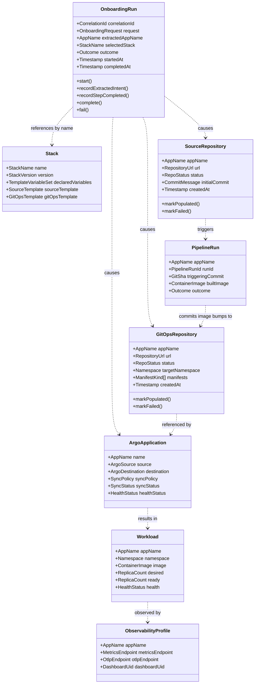
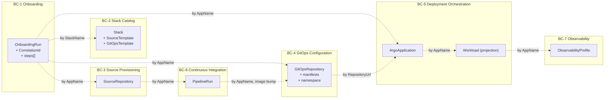
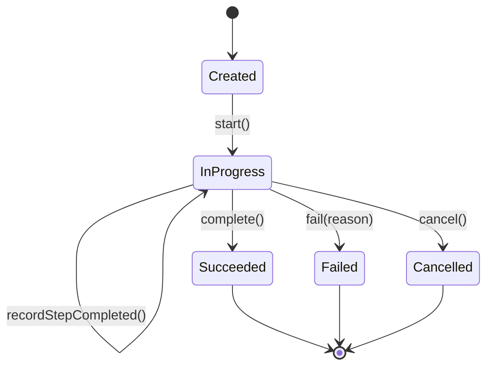
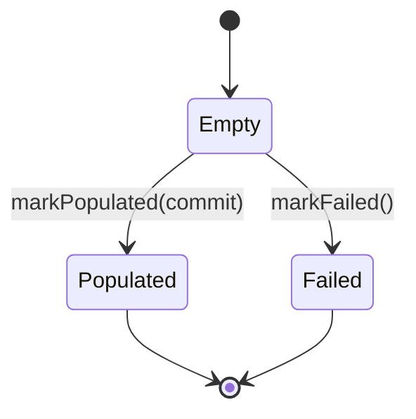
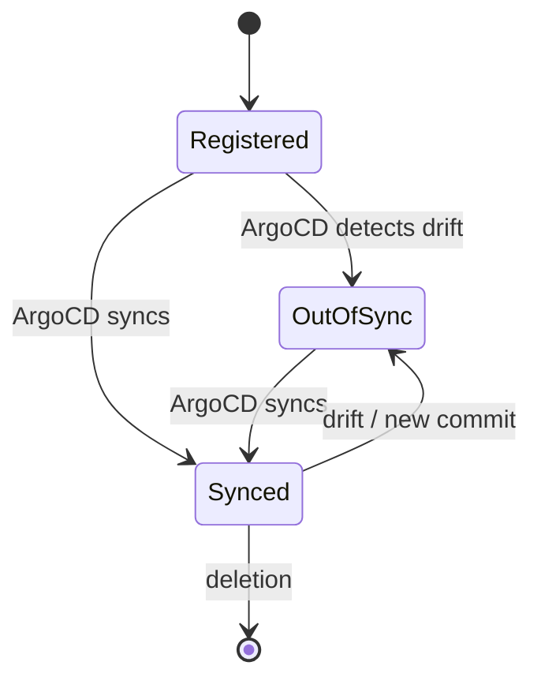
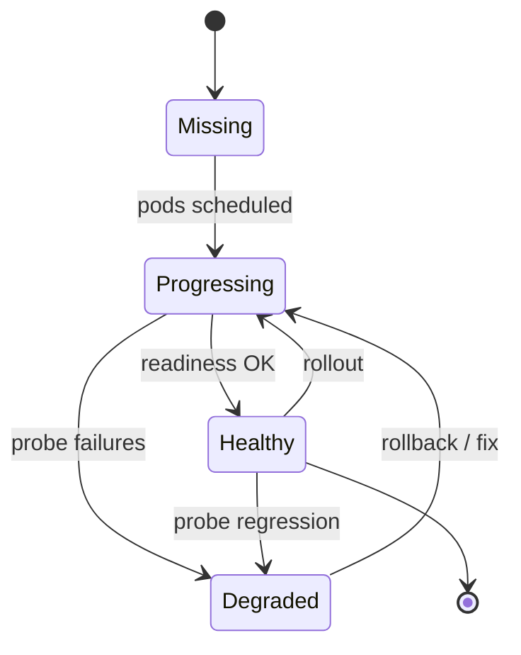
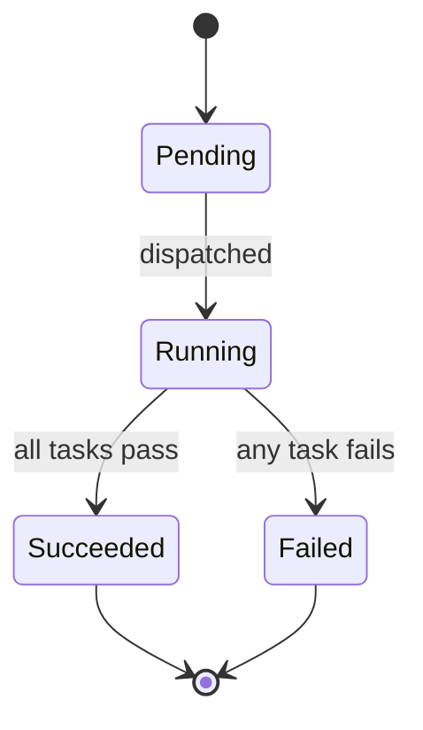

# Aggregate Diagrams

This document supplements [`../05-aggregates-and-entities.md`](../05-aggregates-and-entities.md) with structural and lifecycle diagrams. All diagrams are Mermaid for native GitHub rendering.

## Aggregates and their identifiers

## Aggregate boundaries

Each box in the diagram below is one aggregate (transactional consistency boundary). Lines between boxes represent **eventually consistent** relationships.

## State machines

### `OnboardingRun`

### `SourceRepository` and `GitOpsRepository`

### `ArgoApplication` (status projected from cluster)

### `Workload` health (read-only projection)

### `PipelineRun` (planned)

## Why these boundaries?

- `OnboardingRun` does **not** contain the repositories or the ArgoApplication. They are referenced by name; their lifecycle is independent. A failed `OnboardingRun` may leave behind valid `SourceRepository` and `GitOpsRepository` artefacts that an operator can clean up or recover.
- `Stack` is a *read* aggregate; it never owns mutable state at runtime.
- `SourceRepository` and `GitOpsRepository` are **separate aggregates** because they enforce different invariants and because their lifecycles diverge after creation (one receives application code commits, the other receives image bumps and operator promotions).
- `Workload` is a **projection**, not an aggregate we own. It is included in the model so we can talk about it, but its source of truth is the Kubernetes API.
