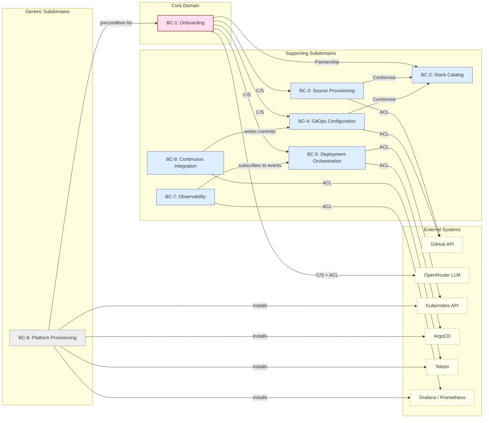
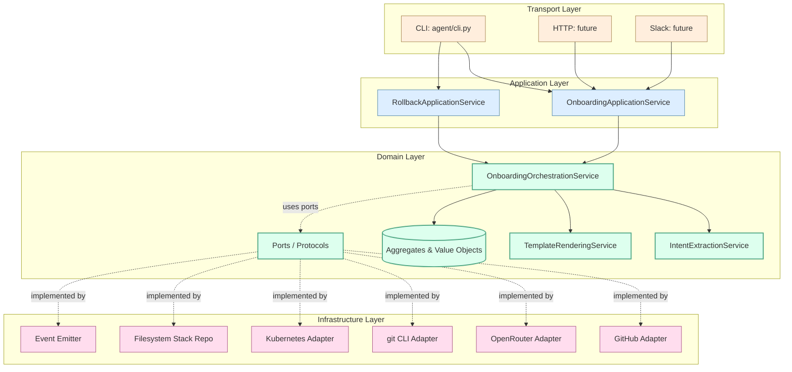
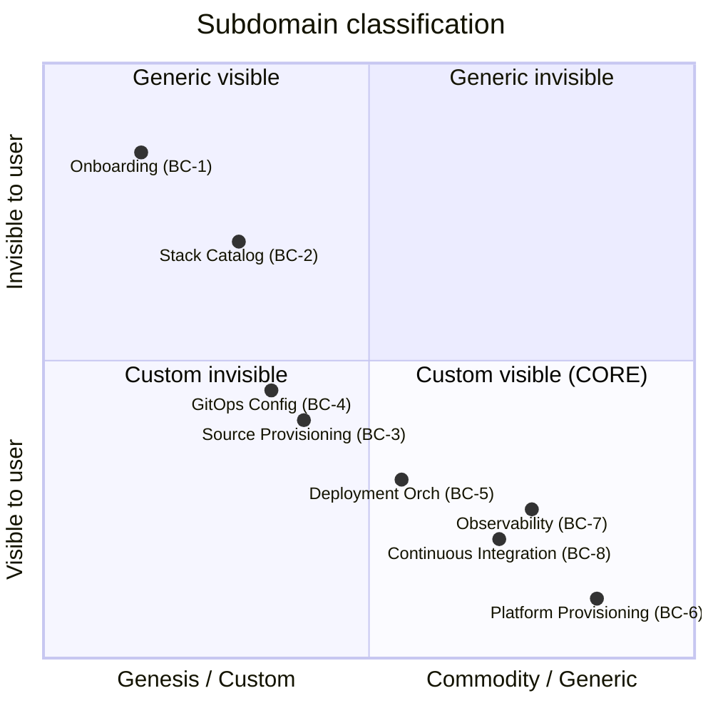
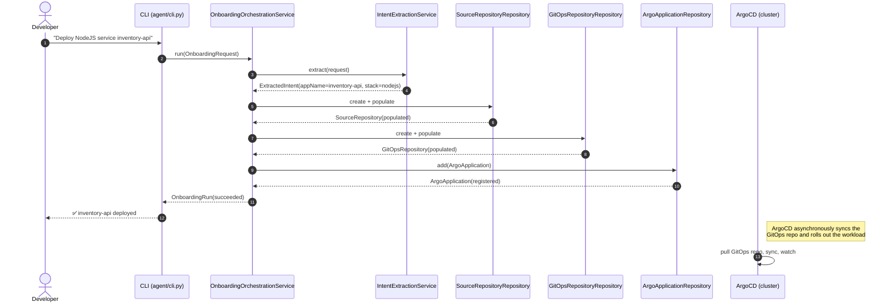

# Context Map (Diagrams)

This document supplements [`../04-context-map.md`](../04-context-map.md) with rendered diagrams. All diagrams are written in Mermaid so they render natively on GitHub.

## High-level context map

## Layered architecture

## Subdomain classification (Wardley-ish)

The further toward the bottom-right, the more we can buy off the shelf. The further toward the top-left, the more our differentiation lies. The diagram says: *invest engineering hours in BC-1; reuse for BC-6/BC-7/BC-8.*

## Data flow at a glance

