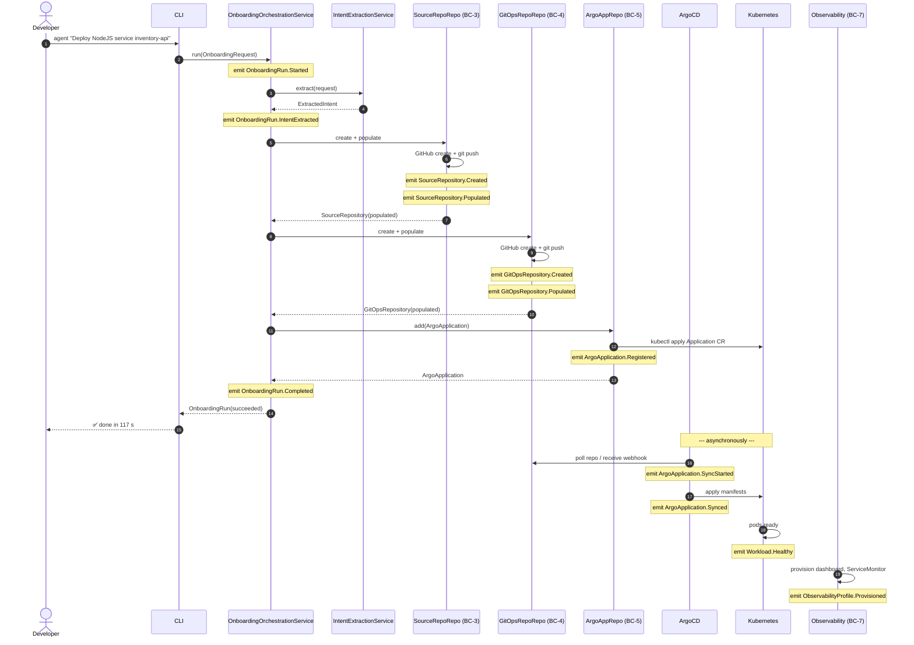
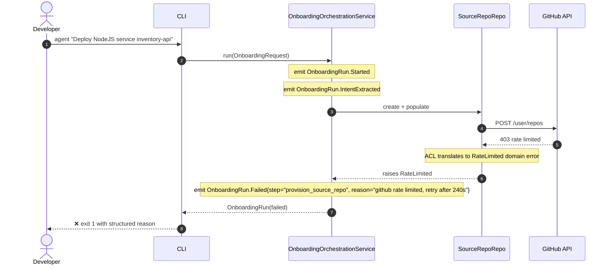
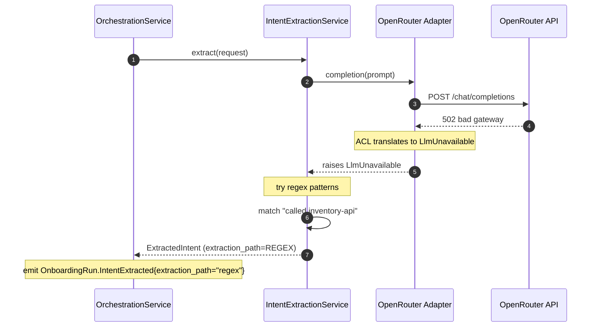
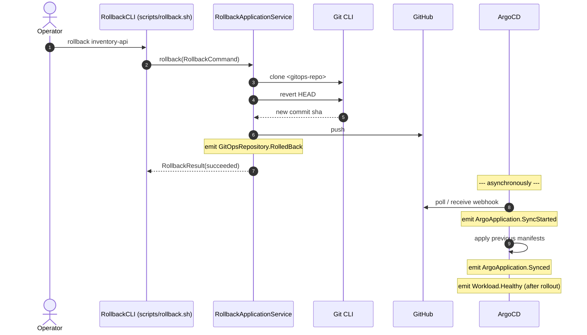
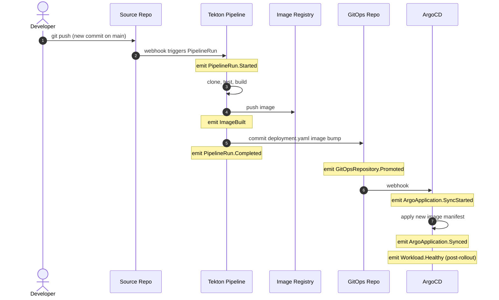
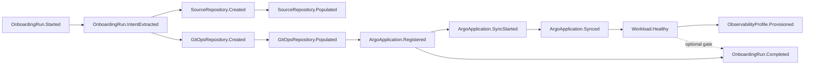

# Event Flow Diagrams

This document supplements [`../07-domain-events.md`](../07-domain-events.md) with end-to-end event flow diagrams for the major scenarios.

## Happy path: a successful onboarding

## Failure path: GitHub rate limit during repo creation

## Failure path: LLM unavailable, fallback succeeds

## Rollback flow

## CI-driven image bump

## Causation graph (per OnboardingRun)

The dotted edge captures the per-profile decision: *demo* completes the run on `ArgoApplication.Registered`; *production* waits for `Workload.Healthy`.
